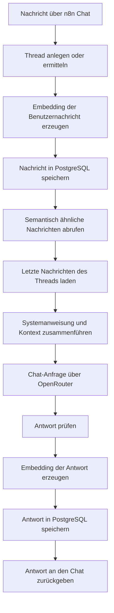

# RAG-Chat mit n8n und PostgreSQL/pgvector

Dieses Repository dokumentiert einen selbst entwickelten und praktisch eingesetzten RAG-Chat-Workflow auf Basis von n8n, PostgreSQL, pgvector und OpenRouter.

Der Workflow speichert Gesprächsnachrichten dauerhaft in PostgreSQL und verwendet Embeddings, um frühere inhaltlich relevante Nachrichten wiederzufinden. Dadurch kann das Sprachmodell neben dem unmittelbaren Gesprächsverlauf auch ältere passende Gesprächsinhalte berücksichtigen.

Es handelt sich derzeit um ein System für semantische Gesprächserinnerung innerhalb einer Sitzung. Es ist noch keine allgemeine Dokumenten- oder Wissensdatenbank.

## Ziel

Der Workflow wurde entwickelt, um folgende Funktionen praktisch umzusetzen:

- dauerhafte Speicherung von Chatverläufen
- Zuordnung von Nachrichten zu einer Gesprächssitzung
- semantische Suche in früheren Nachrichten
- Kombination aus aktuellem Verlauf und älteren relevanten Inhalten
- Speicherung von Embeddings mit pgvector
- Trennung zwischen Workflow-Orchestrierung, Datenhaltung und Modellzugriff
- nachvollziehbare Fehlerbehandlung bei ungültigen Modellantworten

## Architektur



## Verwendete Komponenten

- n8n für die Workflow-Orchestrierung und Chat-Oberfläche
- PostgreSQL für Threads und Gesprächsnachrichten
- pgvector für Speicherung und Vergleich von Embeddings
- OpenRouter als Schnittstelle zu Chat- und Embedding-Modellen
- `minimax/minimax-m2.5` als Chat-Modell zum Zeitpunkt der Dokumentation
- `openai/text-embedding-3-small` als Embedding-Modell
- Docker für den Betrieb der beteiligten Dienste

Die zugehörige Server-, Container- und Backup-Infrastruktur wird im Repository [self-hosted-linux-infrastructure](https://github.com/alexb-labs/self-hosted-linux-infrastructure) dokumentiert.

## Datenmodell

Der aktuelle Workflow verwendet zwei Tabellen.

### `threads`

Ein Thread repräsentiert eine Gesprächssitzung.

Wichtige Felder sind:

- eine UUID als interne ID
- ein eindeutiger `session_key`
- ein einfaches Themenfeld

Beim Eingang einer Nachricht wird der zugehörige Thread angelegt, falls für den übergebenen Sitzungsschlüssel noch kein Eintrag vorhanden ist.

### `messages`

Diese Tabelle speichert die einzelnen Gesprächsnachrichten.

Wichtige Felder sind:

- zugehörige Thread-ID
- Rolle der Nachricht, beispielsweise `user` oder `assistant`
- Nachrichteninhalt
- optionales Embedding
- Erstellungszeitpunkt

Die Verbindung zum Thread wird über einen Fremdschlüssel hergestellt. Embeddings besitzen in der aktuellen Konfiguration 1536 Dimensionen.

Für die Vektorsuche wird ein pgvector-Index verwendet.

## Ablauf des Workflows

### 1. Eingang einer Nachricht

Eine neue Nachricht wird über den n8n-Chat-Trigger entgegengenommen. Der Trigger stellt unter anderem einen Sitzungsschlüssel und den eingegebenen Nachrichtentext bereit.

### 2. Thread ermitteln

Der Workflow legt mit dem Sitzungsschlüssel einen Thread an, falls noch keiner vorhanden ist.

Anschließend wird dessen interne ID geladen. Alle weiteren Datenbankoperationen verwenden diese Thread-ID.

### 3. Embedding der Benutzernachricht

Der Nachrichtentext wird über die OpenRouter-Embedding-Schnittstelle an `openai/text-embedding-3-small` übergeben.

Das zurückgegebene Embedding kann anschließend als Vektor in PostgreSQL gespeichert werden.

### 4. Kurze und generische Nachrichten behandeln

Kurze Bestätigungen wie `thanks`, `okay` oder `sounds good` sollen die spätere semantische Suche nicht unnötig beeinflussen.

Solche Nachrichten werden weiterhin als Teil des Gesprächsverlaufs gespeichert. Ihr Embedding wird jedoch nicht in PostgreSQL übernommen.

In der aktuellen Implementierung wird der Embedding-Aufruf bereits vor dieser Entscheidung ausgeführt. Eine spätere Optimierung könnte die Filterung vor den API-Aufruf verschieben.

### 5. Semantische Erinnerung

Für die semantische Suche werden frühere Nachrichten desselben Threads mit dem Embedding der neuen Nachricht verglichen.

Die aktuelle Abfrage verwendet:

- Kosinus-Ähnlichkeit über pgvector
- Mindestähnlichkeit von `0.65`
- maximal vier semantisch relevante Nachrichten
- einen zusätzlichen Aktualitätswert über einen Zeitraum von 30 Tagen
- eine Gewichtung des Aktualitätswertes mit `0.15`

Vereinfacht wird nach folgendem Prinzip sortiert:

```text
Kosinus-Ähnlichkeit + 0,15 × Aktualitätswert
```

Nachrichten ohne gespeichertes Embedding werden bei dieser Suche nicht berücksichtigt.

### 6. Aktuellen Gesprächsverlauf laden

Zusätzlich zur semantischen Suche werden die letzten sieben Nachrichten des aktuellen Threads geladen.

Der Workflow sortiert diese Nachrichten anschließend chronologisch, damit sie dem Modell in der ursprünglichen Gesprächsreihenfolge übergeben werden.

### 7. Kontext zusammenstellen

Vor dem Modellaufruf erstellt der Workflow ein gemeinsames Nachrichtenfeld aus:

1. einer festen Systemanweisung
2. semantisch relevanten älteren Nachrichten
3. den letzten Nachrichten des aktuellen Gesprächsverlaufs

Doppelte Nachrichten werden entfernt, wenn sie sowohl in der semantischen Auswahl als auch im aktuellen Verlauf vorkommen.

### 8. Modellantwort erzeugen

Der zusammengestellte Kontext wird über OpenRouter an das konfigurierte Chat-Modell gesendet.

Der Workflow prüft anschließend, ob eine verwertbare Antwort vorhanden ist. Eine fehlende oder leere Antwort führt zu einem Workflow-Fehler, anstatt als erfolgreiche Antwort weiterverarbeitet zu werden.

### 9. Antwort speichern

Auch für die Antwort des Assistenten wird ein Embedding erzeugt.

Die Antwort wird mit ihrer Rolle, ihrem Inhalt und gegebenenfalls ihrem Embedding in PostgreSQL gespeichert. Danach wird sie an die Chat-Oberfläche zurückgegeben.

## Semantische und chronologische Erinnerung

Der Workflow kombiniert zwei unterschiedliche Arten von Kontext:

### Chronologischer Kontext

Die letzten sieben Nachrichten bilden den unmittelbaren Gesprächsverlauf ab.

### Semantischer Kontext

Bis zu vier ältere Nachrichten werden anhand ihrer inhaltlichen Ähnlichkeit und ihrer Aktualität ausgewählt.

Diese Kombination soll verhindern, dass ausschließlich die letzten Nachrichten berücksichtigt werden. Gleichzeitig wird nicht der gesamte gespeicherte Verlauf bei jeder Anfrage an das Sprachmodell übertragen.

## Datenschutz und externe Verarbeitung

Gesprächsinhalte und Embeddings werden in der eigenen PostgreSQL-Datenbank gespeichert.

Für die Erzeugung von Modellantworten und Embeddings werden Inhalte an die konfigurierten Modelle über OpenRouter übertragen. Die selbst gehostete Datenbank bedeutet daher nicht, dass die gesamte Verarbeitung ausschließlich auf dem eigenen Server stattfindet.

Produktive Gesprächsinhalte, Zugangsdaten und interne Verbindungsinformationen sind nicht Bestandteil dieses Repositories.

## Verifikation und Backup

Die PostgreSQL-Datenbank ist Bestandteil des dokumentierten Backup-Prozesses der zugehörigen Linux-Infrastruktur.

Ein verschlüsseltes Backup wurde in einer getrennten PostgreSQL-Testumgebung wiederhergestellt. Dabei wurden unter anderem geprüft:

- Wiederherstellung der Tabellen
- vorhandene Nachrichten und Threads
- PostgreSQL-Erweiterungen
- Tabellenverknüpfungen und Constraints
- Vektorindizes
- Anzahl und Dimension gespeicherter Embeddings

Der vollständige Ablauf ist im [Restore-Test der Infrastruktur](https://github.com/alexb-labs/self-hosted-linux-infrastructure/blob/main/docs/restore-test.md) dokumentiert.

## Bekannte Einschränkungen

Die aktuelle Implementierung hat bewusst einen begrenzten Umfang:

- Die semantische Suche ist auf Nachrichten desselben Threads beschränkt.
- Es gibt noch keine Benutzerkonten oder benutzerübergreifende Wissensverwaltung.
- Es gibt noch keine separate langfristige Benutzer-Memory.
- Dokumente und hochgeladene Dateien werden nicht eingelesen oder verarbeitet.
- Die Modell- und Embedding-Auswahl ist direkt im Workflow konfiguriert.
- Die Schwellwerte und Gewichtungen wurden praktisch gewählt, aber noch nicht durch systematische Evaluation optimiert.
- Es gibt noch keine automatisierten Qualitätstests für die abgerufenen Kontexte oder Modellantworten.
- Kurze Nachrichten werden derzeit eingebettet, bevor entschieden wird, ob das Embedding gespeichert werden soll.
- Die öffentliche Workflow-Version ist ein bereinigtes Beispiel und keine vollständig automatisierte Ein-Klick-Bereitstellung.

## Mögliche Weiterentwicklung

Mögliche nächste Schritte sind:

- Verarbeitung und Indexierung eigener Dokumente
- langfristige Memory über mehrere Gesprächssitzungen
- Benutzer- und Berechtigungskonzept
- getrennte Wissensbereiche
- Metadaten und Quellenangaben für gespeicherte Inhalte
- systematische Tests verschiedener Ähnlichkeitsschwellen
- Filterung irrelevanter Nachrichten vor dem Embedding-Aufruf
- automatisierte Tests für Datenbankabfragen und Workflow-Ausgaben
- konfigurierbare Modell- und Embedding-Auswahl

## KI-gestützte Arbeit

Bei Teilen der Workflow-Entwicklung, SQL-Abfragen, Fehleranalyse, Tests und Dokumentation kamen KI-gestützte Werkzeuge zum Einsatz.

Der Workflow wurde in der eigenen Umgebung ausgeführt. Die beschriebenen Datenbank-, Backup- und Restore-Funktionen wurden anhand der dokumentierten Ergebnisse überprüft.
